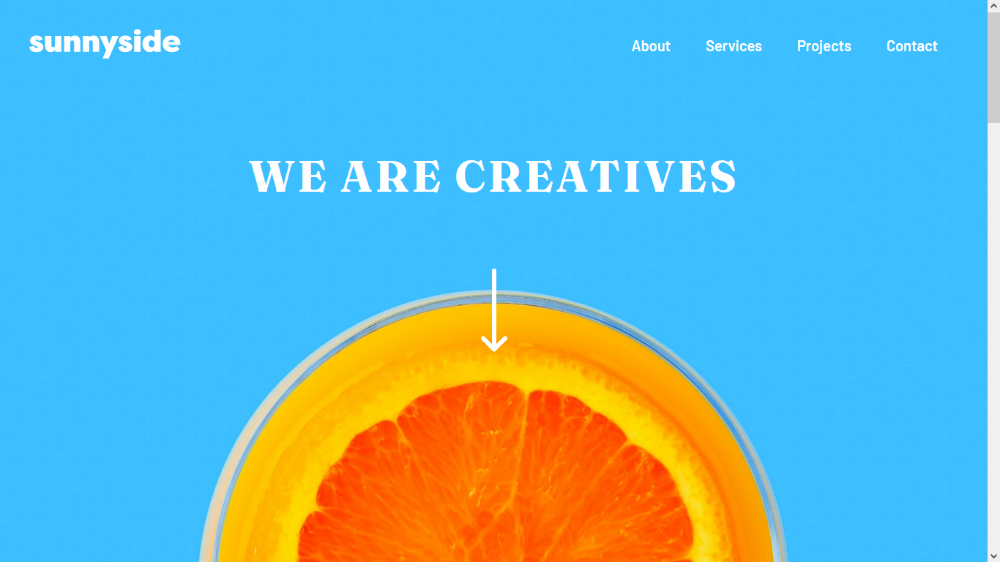
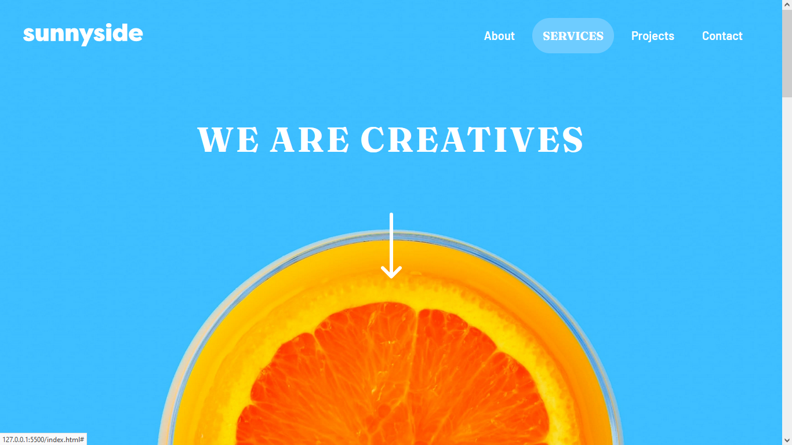
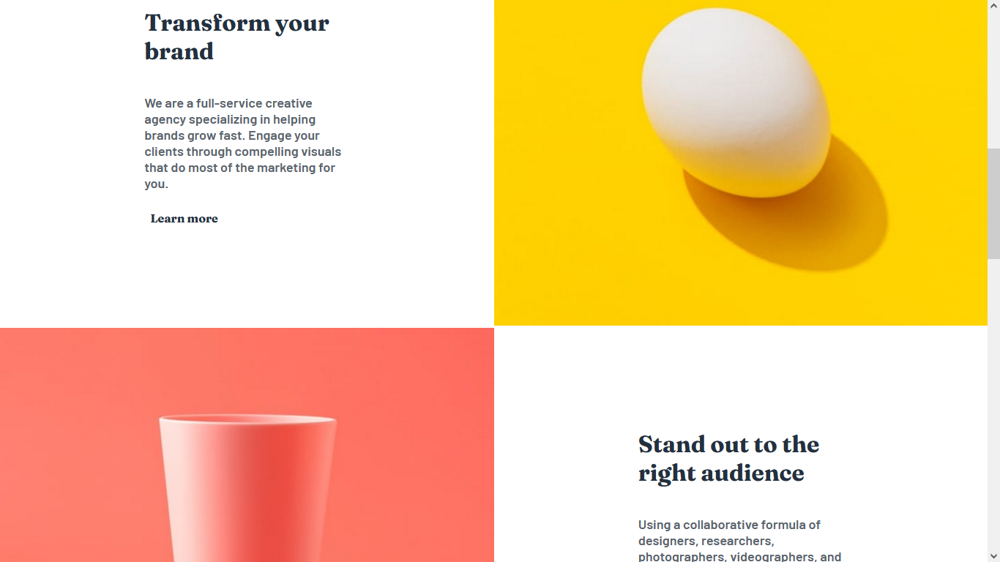
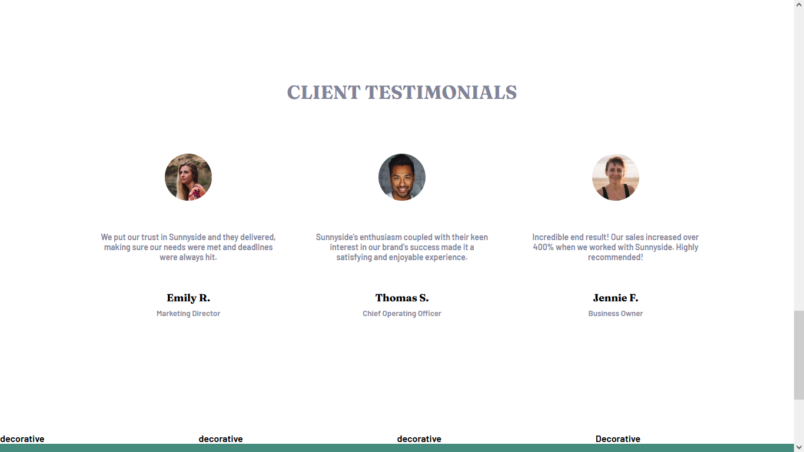
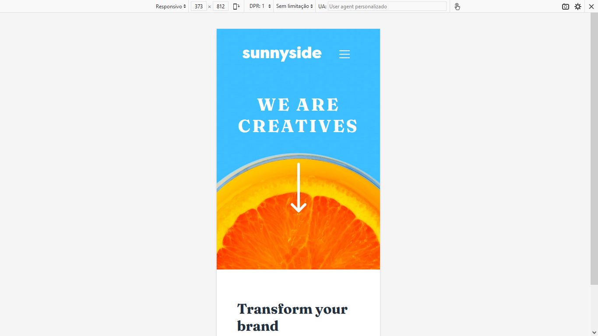
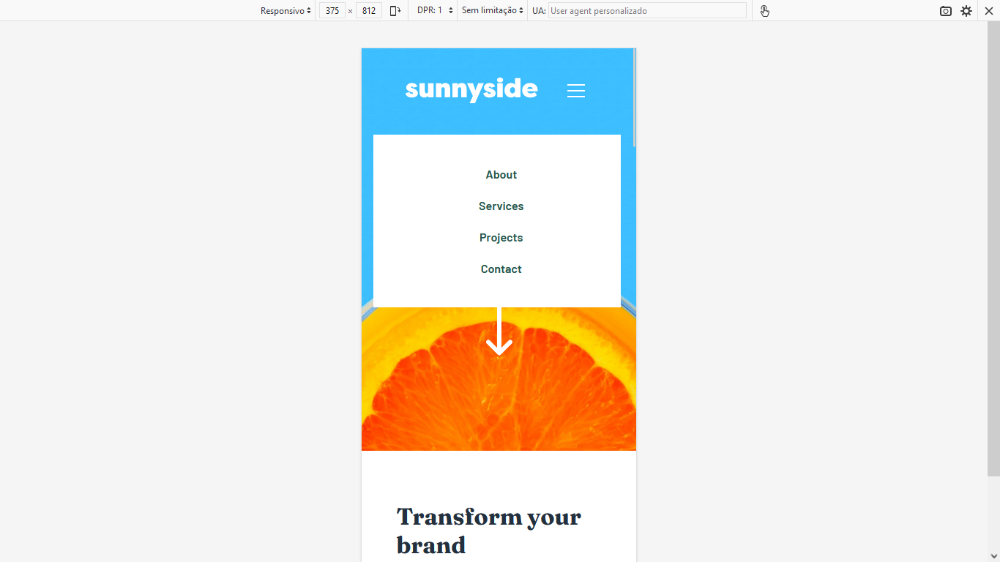
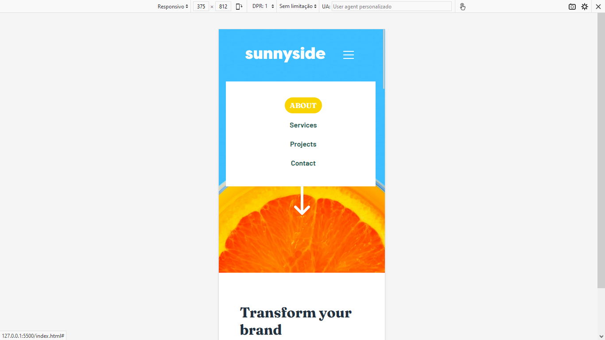
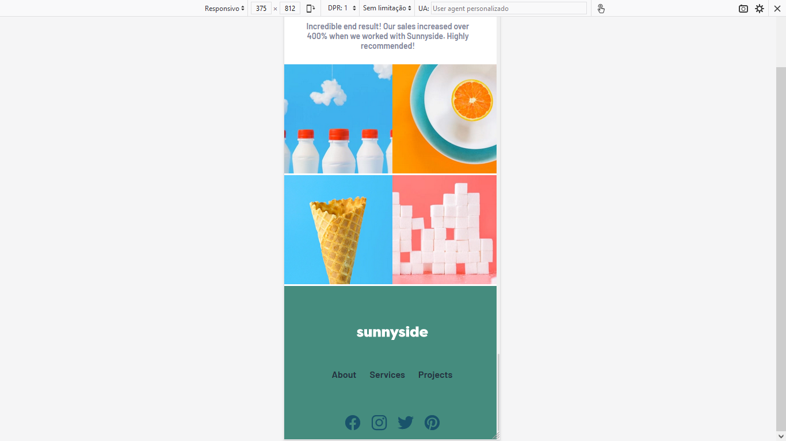
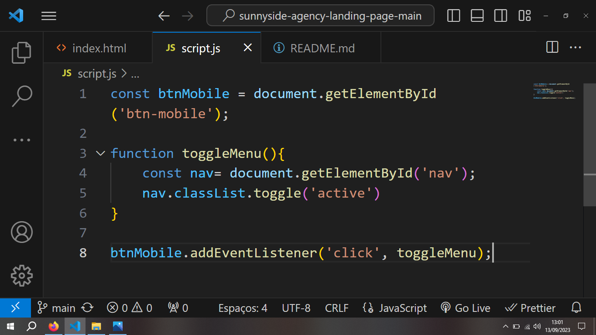

<h1>Desafio Sunnyside Agency Frontend Mentor</h1>
 

Neste desafio, eu utilizei grid para ajustar alguns elementos.

 
<h2>Layout desktop</h2>
 

 
<h2>layout desktooop com hover no menu  </h2>
 

 
<h2>Detalhes de alguns elementos com grid  </h2>
 

 
<h2>Detalhes de alguns elementos flexbox </h2>
 

 
<h2>Layout mobile </h2>
 

 
<h2>Layout mobile com detalhe da ativação do  menu  </h2>
 

 
<h2>Layout mobile com detalhe para hover no menu  </h2>
 

 
<h2>Detalhe do grid sendo utilizado no mobile  </h2>
 

 
<h2>Código JS utilizado</h2>
 

 
<h3>Sobre o desafio></h3>

Neste desafio, que subestimei e achei que seria mais fácil, pois o layout parecia ser bem simples, eu avabei me enrolando bastante no css com o Display Grid. Preciso me aprofundar no assunto pois vi que não sei de nada kkk.  
Em suma, gostei bastante do desafio.

